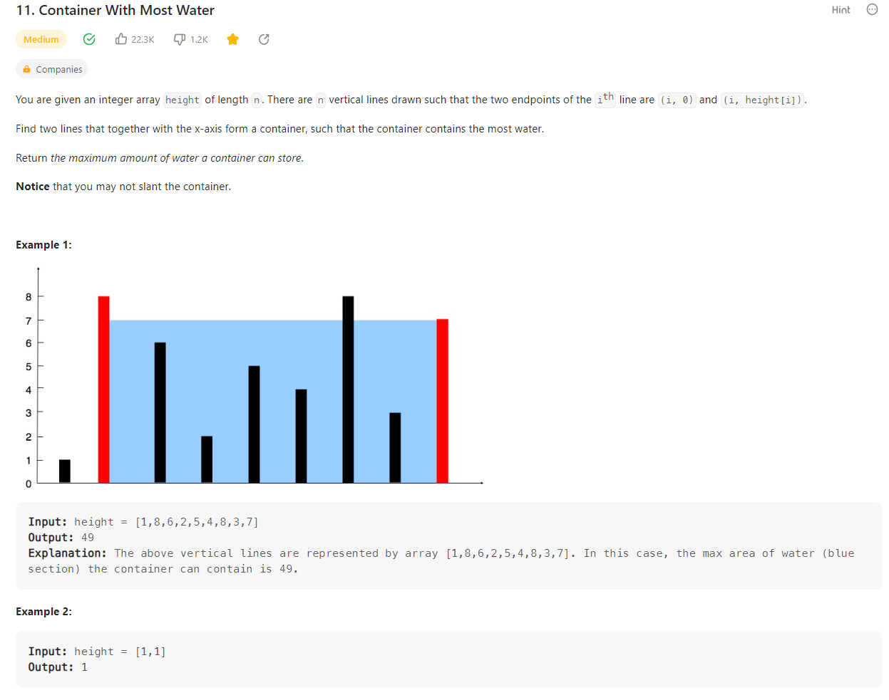

# 0121 Problem11 Container With Most Water




+ Solution1 : 用兩個 for 迴圈跑 time complexity = O(n^2) 超時

```c
class Solution {
public:
    int maxArea(vector<int>& height) {
        int size = height.size();
        int area = 0;
        int temp = 0;
        for(int i=size-1;i>0;i--){
            for(int j=0;j<=size-2;j++){
                temp = min(height[i],height[j])*(i-j);
                area = max(area,temp);
            }
        }
        return area;
    }
};
```

+ Solution2 : 只用一個 for 迴圈，維護前後指針 i 和 j，當後面指針的高度較大時，前指針往前，前面指針高度較大時，後指針往前，相同時一起往前。

```c
class Solution {
public:
    int maxArea(vector<int>& height) {
        int size = height.size();
        int area = 0;
        int temp = 0;
        int j = 0;
        int i = size-1;

        while(i>j){
            temp = min(height[i],height[j])*(i-j);
            area = max(area,temp);  
            if(height[i]>height[j]){
                j++;
            }else if(height[i]==height[j]){
                j++;
                i--;
            }else{
                i--;
            }  
        }
        return area;
    }
};
```