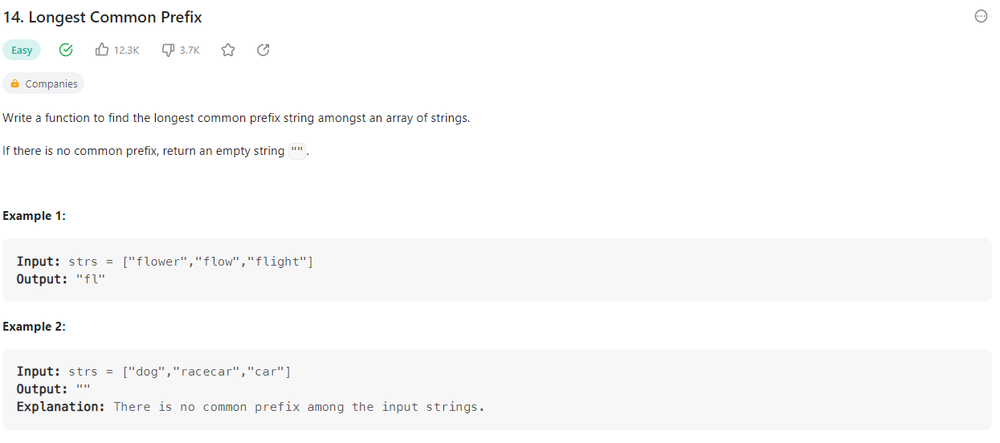

# 0124 Problem14 Longest Common Prefix

+ Easy



```cpp
class Solution {
public:
    string longestCommonPrefix(vector<string>& strs) {
        int size = strs.size();
        int temp;
        int target = 1000;
        int ans = 0;

        for(int i=0;i<size;i++){
            if(strs[i].size() < target){
                target = strs[i].size();
            }
        }

        int k = 0;
        while(k<target){
            for(int j=0;j<size;++j){
                if( strs[j][k] != strs[0][k]){

                    temp = j;
                    j = strs.size();
                    k = target;
                }
                temp = j;
            }
            ++k;
            if(temp==size-1){++ans;}
        }

        return strs[0].substr(0,ans);
    }
};

```