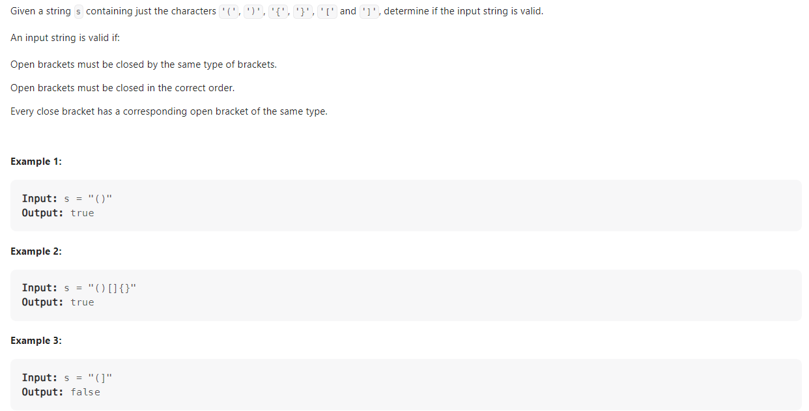

# 0121 Problem20 Valid Parentheses




+ 用 vector 來實作 stack 解

```c
class Solution {
public:
    bool isValid(string s) {
        vector<char> a;

        for(auto temp : s){
            if(temp=='('||temp=='['||temp=='{'){
                a.push_back(temp);
            }else{
                if(a.size()==0){
                    return false;
                }else if(( temp==')' && a.back()!='(') || (temp==']' && a.back()!='[') || (temp=='}' && a.back()!='{') ){
                    return false;
                }
                a.pop_back();
            }
        
        }
        if(a.size()==0) return true;
        return false;
    }
};
```

+ C++ 內建有 stack library

```c
class Solution {
public:
    bool isValid(string s) {
        stack<char> a;

        for(auto temp : s){
            if(temp=='('||temp=='['||temp=='{'){
                a.push(temp);
            }else{
                if(a.size()==0){
                    return false;
                }else if(( temp==')' && a.top()!='(') || (temp==']' && a.top()!='[') || (temp=='}' && a.top()!='{') ){
                    return false;
                }
                a.pop();
            }
        
        }
        if(a.size()==0) return true;
        return false;
    }
};
```


+ Time Complexity : O(n)