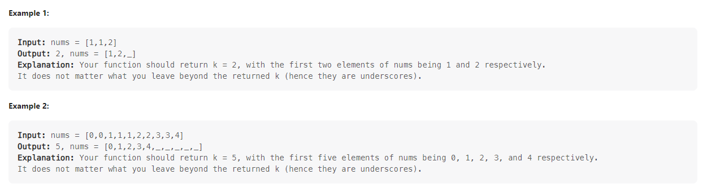

# Problem 26 Remove duplicates from sorted array



+ 如果直接使用 erase() 刪除重複元素，會因為一直 call erase() 造成 performance 不佳

```c

class Solution {
public:
    int removeDuplicates(vector<int>& nums) {
        int i = 0;
        int j = 1;
        int temp = nums[i];
        int k = nums.size();
        while(k>0){
            if(nums[i]==temp){ // 元素相同的話就將 i 指標往前
                i++;
            }else{ // 否則將不同的元素寫入 j 位置，並更新 temp 後將 i 指標 j 指標往前
                nums[j] = nums[i]; 
                temp = nums[i];
                j++;
                i++;
            }            
            k--;
        }
        nums.erase(nums.begin()+j,nums.end());

        return nums.size();
    }
};

```