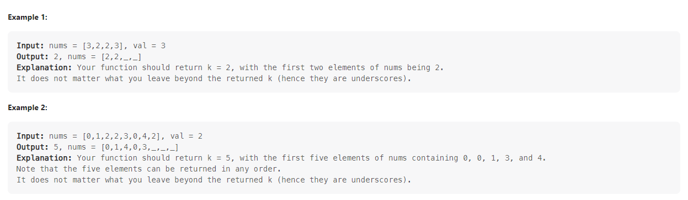

# Problem 27 RemoveElement



+ 用一個指標維護

```c
class Solution {
public:
    int removeElement(vector<int>& nums, int val) {
        int n = nums.size();
        int j = 0;
        int temp;

        for(int i=0;i<nums.size();i++){
            if(nums[i]==val){
                temp = nums[i];
                nums[i] = nums[j];
                nums[j] = temp; 
                j++;
                continue;
            }
        }
        nums.erase(nums.begin(),nums.begin()+j);
        return n-j;
    }
};


```