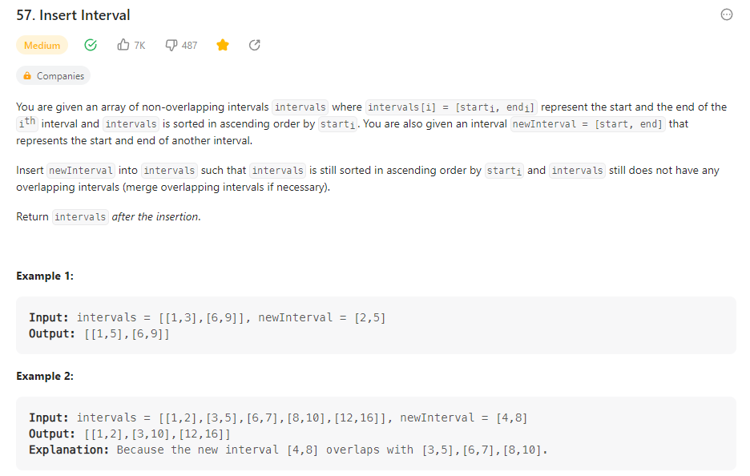

# Problem57 Insert Interval




+ 考慮兩種情況 :
    1. newInterval 與 intervals[i] 沒有重疊
        -> 直接將 intervals[i] 加進結果
    2. newInterval 與 intervals[i] 有重疊
        -> 迭代最小最大值得出區間後加進結果
```c
class Solution {
public:
    vector<vector<int>> insert(vector<vector<int>>& intervals, vector<int>& newInterval) {
        vector<vector<int>> res;
        int i=0;
        int n = intervals.size();

        while(i<n && intervals[i][1]<newInterval[0]){
            res.push_back(intervals[i]);
            i++;
        }
        while(i<n && intervals[i][0]<newInterval[1]){
            newInterval[0] = min(intervals[i][0],newInterval[0]);
            newInterval[1] = max(intervals[i][1],newInterval[1]);
            i++;
        }
        res.push_back(newInterval);

        while(i<n){
            res.push_back(intervals[i]);
            i++;
        }
    }
};

```