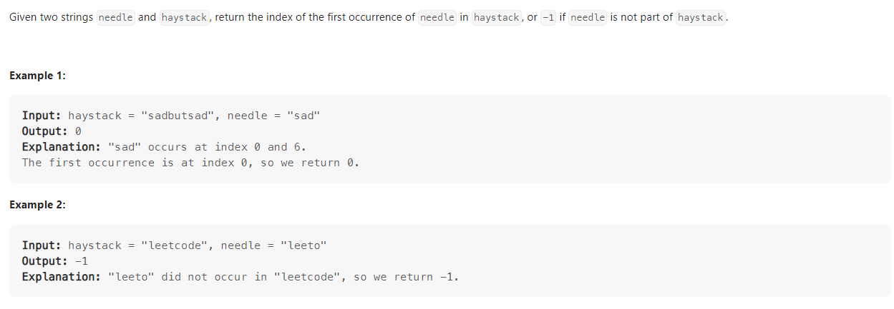

# 0119 Problem974 Subarray Sums Divisible by K



+ Time Complexity : O(n+m)
```c
class Solution {
public:
    int strStr(string haystack, string needle) {
        int n = haystack.length();
        int m = needle.length();
        int result = -1;
        int flag;

        for(int i=0;i<=n-m;i++){
            flag = -1;
            for(int j=0;j<m;j++){
                if(haystack[i+j]!=needle[j]){
                    break;
                }
                if(j==m-1){
                    result = i;
                    flag = 1;
                    break;
                }
            }
            if(flag==1) break;
        }
        return result;
    }
};

```
